# Лаба 1 — Полный мониторинг маленького сервиса

**Цель**: сделать маленький простой сервис и поднять для него полный мониторинг: метрики, логи и трейсы.

> [!NOTE]
> После беззаботного времени на Windows просим GRUB запускать Ubuntu. Удивляемся, как удобно она была настроена. Синхронизируем vscode, музыку, браузер и конфигурацию Выхода Прямо в Нормальный инет (ВПН). Донастраиваем ещё приколов, приближаясь к полной миграции с окон на линукс, и в бой.

## Часть 1 — Маленький сервис с кнопками

Создаем директорию под лабу `/lab1`, внутри под приложение `/app` — вынесем туда vibecode. Просим чатик поработать python fastapi джуном на полставочки. Получаем на выходе: `app.py`, `index.html`, `requirements.txt`, `Dockerfile`.

Команды докера давно забыты, поэтому сразу описываем, что хотим и `docker compose up --build`.

```yml
services:
    app:
        build: ./app
        container_name: app
        ports:
            - "8000:8000"
```

Далее итерациями ругаем чатик за ошибки, вносим мелкие исправления по стилям. Получается минималистичный сайтик на `http://localhost:8000/`.


> [!NOTE]
> Производим фиксацию результата.
> Репозиторий был создан на общем томе. Добавил репозиторий в доверенные, чтобы не ругался.
> Изменения были написаны не в той ветке. Минут 15 пожанглировав в git удалось создать нормально первый коммит и от него перевести работу в ветку `lab1`.

## Часть 2 — Метрики (Prometheus + Grafana)

### Prometheus

Далее описываем настройки Prometheus: собирать метрики каждые 5 секунд, для сбора использовать группу (назовем её `app`) с единственной целью на адресе контейнера `app:8000`.

```yml
global:
    scrape_interval: 5s

scrape_configs:
    - job_name: "app"
      static_configs:
          - targets: ["app:8000"]
```

Описываем сервис с конфигурацией выше (прокинем для проверки порт 9090 наружу).

```yml
prometheus:
    image: prom/prometheus:latest
    container_name: prometheus
    ports:
        - "9090:9090"
    volumes:
        - ./prometheus.yml:/etc/prometheus/prometheus.yml
```

Командуем `docker compose up --build`, открываем `http://localhost:9090/`. По запросу `up` посмотрим график работы приложения за последние 10 минут.


### Grafana

Не опять, а снова описываем сервис Grafana, перезапускаем.

```yml
grafana:
    image: grafana/grafana:latest
    container_name: grafana
    ports: - "3000:3000"
```

Открываем `http://localhost:3000/`, меняем пароль, подключаем источник метрик: `http://prometheus:9090`.


> [!NOTE]
> Я, конечно, подключил, но мне очень неприятно стало, что это произошло в GUI! Поэтому...

Далее создаем конфиг `grafana-datasource.yml`, который буквально нужен для указания источников данных.

```yml
apiVersion: 1

datasources:
    - name: Prometheus
      type: prometheus
      access: proxy
      url: http://prometheus:9090
      isDefault: true
```

Монтируем к сервису в compose.

```yml
volumes:
    - ./grafana-datasource.yml:/etc/grafana/provisioning/datasources/grafana-datasource.yml
```

> [!NOTE]
> Почему-то я решил в части названий и имен написать `ph` вместо `f`. Минут 10 ругался с компьютером, докером и чатиком. А потом заметил опечатку...

Теперь Prometheus как источник автоматически подключается к Grafana.


### Дашборд по RED

Для начала составим PromQL запросы по RED (попутно разбирая команды с чатиком).

- _Rate (запросы в секунду): `rate(http_requests_total[1m])`_
- _Errors (доля запросов с ошибкой): `rate(http_errors_total[1m]) / rate(http_requests_total[1m]) * 100`_
- _Duration (p95): `histogram_quantile(0.95, rate(http_request_duration_seconds_bucket[1m]))`_

> [!WARNING]
> Пробуем реализовать графики в GUI Grafana. Первый `rate(http_requests_total[1m])` зашел хорошо (и показывал только один график), на следующем же `rate(http_errors_total[1m]) / rate(http_requests_total[1m]) * 100` возникла проблема - данные не отрисовывались. Разобрал по частям, заметил, что `rate(http_requests_total[1m])` вдруг стал отдавать несколько графиков, догадался, что проблема может быть в этом. Вслепую просумировал (наугад обернул в `sum`) числитель и знаменатель второй формулы: заработало. Изменяем формулы: теперь на первом графике общее число запросов, на втором - процент ошибок от общего числа.

- **Rate (запросы в секунду): `sum(rate(http_requests_total[1m]))`**
- **Errors (доля запросов с ошибкой): `sum(rate(http_errors_total[1m])) / sum(rate(http_requests_total[1m])) * 100`**
- **Duration (p95): `histogram_quantile(0.95, sum(rate(http_request_duration_seconds_bucket[1m])) by (le))`**

> [!NOTE]
> Честно отработанный курс матстата решил вдруг исчезнуть из головы и я немного подзавис на интерпретации третьего графика. Покумекав и поболтав с чатиком, дошло, что изображено и что нужно отображать вообще не гистограмму, а time series.

Получаем вот такой красивенький дашборд, настроенный руками.


Далее экспортируем дашборд и описываем конфигурацию для его автоподгрузки.

Создаем конфиг `grafana-dashboards.yml`, который нужен для указания источников дашбордов (_где-то мы это уже видели_).

```yml
apiVersion: 1

providers:
    - name: "Dashboards"
      orgId: 1
      folder: ""
      type: file
      disableDeletion: false
      updateIntervalSeconds: 10
      allowUiUpdates: true
      options:
          path: /var/lib/grafana/dashboards
```

Монтируем к сервису в compose (_и это тоже видели_).

```yml
volumes:
    - ./grafana-dashboard.yml:/etc/grafana/provisioning/dashboards/grafana-dashboard.yml
    - ./dashboards:/var/lib/grafana/dashboards
```

> [!NOTE]
> На этом моменте были потеряны данные сбора метрика, произнесено "какая неудача!" и добавлен volume для prometheus.

Теперь можно сохранять настроенные дашборды в `/dashboards` и они будут автоматически подгружены с пометкой `Managed by: file provisioning`.


## Часть 3 — Логи (Loki + Fluent Bit → Grafana)

> [!NOTE]
> Я уже пробовал внедрять _Grafana + Prometheus_ в свои проекты, а начиная с третьей части таких технологий я никогда раньше не трогал. Смута началась, когда я увидел, что **Promtail - EOL** (_узнал новую аббревиатуру: конец жизни_). Сразу возникло желание посмотреть на альтернативы.
>
> Официальная команда Grafana предлагает миграции на _Grafana Alloy_: инструмент, который сочетает в себе сбор и метрик, и логов... Но в контексте текущей лабораторной это плохой вариант: мы все-таки уже как минимум используем _Prometheus_ для метрик, поэтому стоит продолжить изучать ~~зоопарк~~ все многообразие технологий.
>
> А для чисто замены _Promtail_ чатик предложил кроме всего прочего **Fluent Bit**: по заявлениям он приятно встанет на место агента по сбору логов (тем более, что конфигурируется он тоже в любимом yml).

### Подключение Loki в Grafana

Сразу в `graphana-datasource.yml` добавим Loki как источник.

```yml
- name: Loki
  type: loki
  access: proxy
  url: http://loki:3100
```

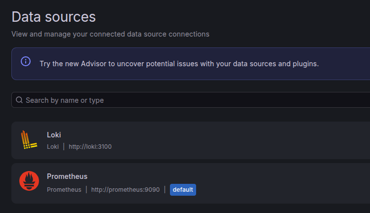

### Loki + Fluent Bit

На первых попытках сделать эту часть я использовал официальную документацию Grafana и LLM, однако у меня никак не получалось адекватно собрать связку, используя агент _Fluent Bit_.

Итерация 1.

> [!WARNING]
> При первом старте Loki возникла ошибка: `error="starting module query-scheduler-ring: context canceled"`. Судя по логам, Loki пытался подключаться к какому-то внешнему хранилищу `localhost:8500`, настроим в конфиге хранилище.

Итерация 2.

> [!WARNING]
> Fluent Bit стал сыпать в лог информацией о CPU, волшебой командой из чатика посмотрим на используемый при запуске конфиг: он оказался в нативном формате `.conf`, изменим команду запуска, чтобы использовался наш `.yaml` конфиг.

Итерация 3.

> [!WARNING]
> Ошибка в логах Loki: агент не может найти парсер докера: `parser 'docker' is not registered`. Добавим описание парсера.

Итерация 4.

> [!WARNING]
> Данные не парсятся из-за ошибок 400 от Loki, потому что они слишком старые, И эта ситуация не менялась, какие бы настройки я не менял за десятки попыток. К тому же на эти данные не вешались метки названия контейнера: я не видел способа различить меж собой логи разных контейнеров.

Тактически отступаем и начинаем ресерч: натыкаемся на [статью](https://dev.to/thakkaryash94/docker-container-logs-using-fluentd-and-grafana-loki-a15?ysclid=mu2tj770xz150987434), в которой было написано, что для этого агента необходимо настроить логирование через _Fluentd_ (а ещё там использовался образ `grafana/fluent-bit-plugin-loki`). Взяв примеры кода из [репозитория](https://github.com/thakkaryash94/docker-grafana-loki-fluent-bit-sample), продолаем упорно заставлять это работать.

Итерация 5.

> [!WARNING]
> Падение с `failed to initialize logging driver`, решение: поправить адрес драйвера на правильный `127.0.0.1:24224`.

Итерация 6.

> [!WARNING]
> Падение с `loki: unknown configuration property 'url'`, это скорее из-за разницы версий просто нужно заменить `url` на `uri`, `host` и `port`.

Итерация 7.

> [!WARNING]
> Падение с `invalid label key`, тут настройка `labels_key` не нужна и не существует. Просто удаляем, ведь без подобной настройки `container_name` сохраняется.

И, наконец, все запустилось без ошибок и даже показало результат.

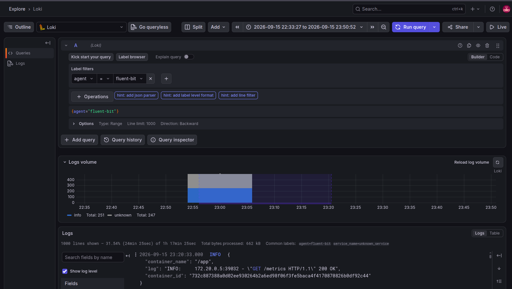

### Итоговая конфигурация

Сначала описываем сервисы в compose, не забывая про volume.
Настраиваем необходимые условия из статьи.

```yml
services:
  app:
    ...
    logging:
      driver: fluentd
      options:
        fluentd-address: "127.0.0.1:24224"
        fluentd-async: "true"
  ...
  loki:
    image: grafana/loki:latest
    container_name: loki
    ports:
      - "3100:3100"
    volumes:
      - ./loki.yml:/etc/loki/local-config.yaml
      - loki-data:/loki
    command: -config.file=/etc/loki/local-config.yaml

  fluent-bit:
    image: grafana/fluent-bit-plugin-loki:latest
    container_name: fluent-bit
    environment:
      - LOKI_URL=http://loki:3100/loki/api/v1/push
    volumes:
      - ./fluent-bit.yml:/fluent-bit/etc/fluent-bit.yaml:ro
    ports:
      - "24224:24224"
      - "24224:24224/udp"
    command:
      ["/fluent-bit/bin/fluent-bit", "-c", "/fluent-bit/etc/fluent-bit.yaml"]
volumes:
  ...
  loki-data:
```

> [!NOTE]
> Restart намеренно игнорируется в compose на данном этапе, чтобы при падении не приходилось искать ошибку среди перезапусков. На этом же моменте я добавил `ro` и для конфигов: кажется, так безопаснее.

Для Loki обычная конфигурация для использования хранилища.

```yml
auth_enabled: false

server:
    http_listen_port: 3100

common:
    path_prefix: /loki
    ring:
        instance_addr: 127.0.0.1
        kvstore:
            store: inmemory
    replication_factor: 1
    storage:
        filesystem:
            chunks_directory: /loki/chunks
            rules_directory: /loki/rules

schema_config:
    configs:
        - from: 2026-01-01
          store: tsdb
          object_store: filesystem
          schema: v13
          index:
              prefix: index_
              period: 24h

storage_config:
    filesystem:
        directory: /loki/chunks
```

И, наконец, конфиг в `yml` типа вход - выход для Fluent Bit.

```yml
service:
    flush: 1
    log_level: info

pipeline:
    inputs:
        - name: forward
          listen: 0.0.0.0
          port: 24224

    outputs:
        - name: loki
          match: "*"
          host: loki
          port: 3100
          uri: /loki/api/v1/push
          remove_keys: source
          labels: agent=fluent-bit
          line_format: json
```

### Чистим логи

Посмотрим на вывод `app`. Безобразие!

```txt
app | {"level": "INFO", "message": "request completed", "trace_id": "2bdbb635-29fa-4828-8b00-5613a28b950c", "method": "GET", "path": "/metrics", "status": 200, "duration_seconds": 0.0012}
app | INFO: 172.20.0.5:39032 - "GET /metrics HTTP/1.1" 200 OK
```

Избавляемся от стандартных логов Uvicorn в Dockerfile.

```Dockerfile
CMD ["uvicorn", "app:app", "--host", "0.0.0.0", "--port", "8000", "--no-access-log"]
```

### Поиск ошибок в логах

Выполняем запрос `{agent="fluent-bit"} |= "ERROR"` к Loki и радуемся.

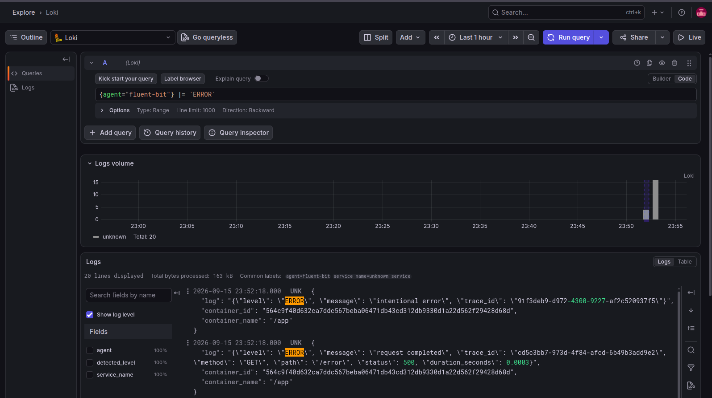

## Часть 4 — Трейсы (OpenTelemetry → Jaeger)

### Single Jaeger

Немного поправляем app под правильную раздачу трейсов. Затем разбираемся с Jaeger, `all-in-one` версию запустить очень просто из коробки.

```yml
jaeger:
    image: jaegertracing/all-in-one:latest
    container_name: jaeger
    ports:
        - "4317:4317"
        - "16686:16686"
```

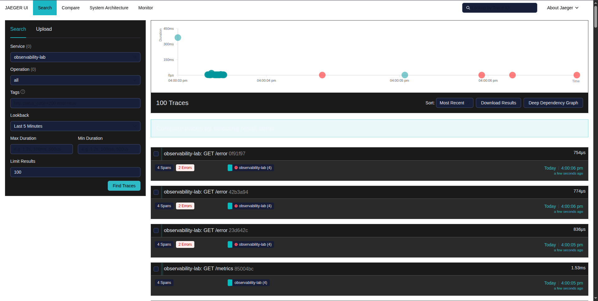

### Jaeger + OTel Collector

Для коллектора нужен приемник, процессор и экспортер. В конфиге коллектора оставляем все стандарыми.

```yml
receivers:
    otlp:
        protocols:
            grpc:
                endpoint: 0.0.0.0:4317
            http:
                endpoint: 0.0.0.0:4318

processors:
    batch:

exporters:
    otlp_grpc:
        endpoint: http://jaeger:4317
        tls:
            insecure: true

service:
    pipelines:
        traces:
            receivers: [otlp]
            processors: [batch]
            exporters: [otlp_grpc]
```

Описываем все необходимое в compose (_снова_). Помимо прочего при дебаге обнаружим, что в `jaegertracing/all-in-one` версия v1 - EOL. Поменяем.

```yml
services:
  app:
    ...
    environment:
      - OTEL_EXPORTER_OTLP_ENDPOINT="otel-collector:4317"
  jaeger:
    image: cr.jaegertracing.io/jaegertracing/jaeger:2.21.0
    ...
  otel-collector:
    image: otel/opentelemetry-collector:latest
    container_name: otel-collector
    volumes:
      - ./otel-collector.yml:/etc/otelcol/config.yaml:ro
    command: ["--config=/etc/otelcol/config.yaml"]
```

> [!WARNING]
> При запусках коллектора то коллектор не мог отправить джагеру, то приложение коллектору. Решилось это подбором: где-то нужен `http://`, где-то нужен дополнительный флаг, где-то ваще ничего не нужно.

### Работа в Jaeger UI

Открываем Jaeger, выбираем сервис в поиске. Видим трейсы переодически запрашиваемых метрик, значит, как минимум работает.

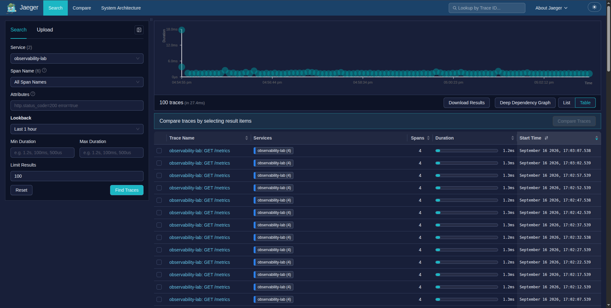

Создаем запрос с задержкой - видим slow_dependency на всю длину запроса (остальные действия пренебрежимо малы и незаметны).

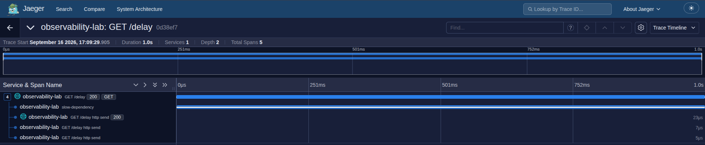

Создаем ошибку - видим красненький спан.

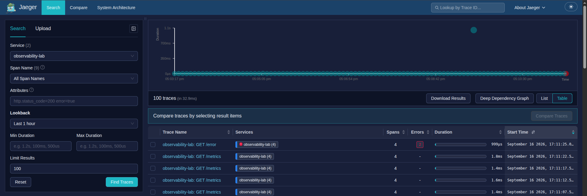

Находим случайную ошибку в Grafana и по поиску находим её в Jaeger.

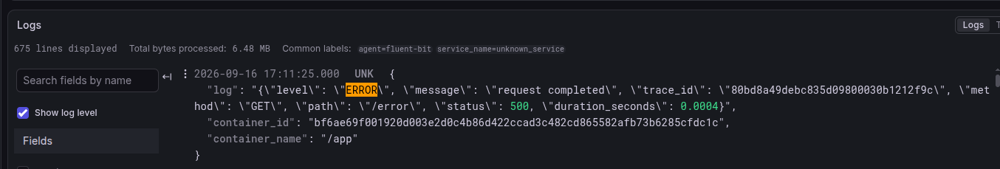
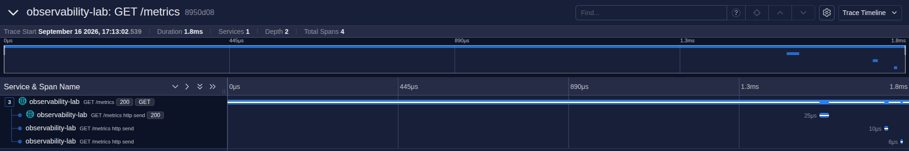

## Часть 5 — Алерты в Alertmanager

### Составление правил алертов

Опишем правила алертов на promQL.

- Высокая доля ошибок (`HighErrorRate`)

```txt
sum(rate(http_errors_total[1m]))
/
sum(rate(http_requests_total[1m]))
> 0.2
```

Сработает при доле ошибок более 20% в течение 10 секунд.

> [!NOTE]
> Тут я задался вопросом: почему я беру все ошибки `http_errors_total`, а не только 5XX. Но пересмотрев вайбкод, увидел, что эта переменная увеличивается только при 5XX.

- Всплеск запросов (`HighRequestRate`)

```txt
sum(rate(http_requests_total[1m])) > 200
```

Сработает при скорости более 200 запросов в секунду в течение 10 секунд.

- Высокая задержка p95 (`HighP95Latency`)

```txt
histogram_quantile(
    0.95,
    sum(rate(http_request_duration_seconds_bucket[1m])) by (le)
) > 1
```

Сработает, при превышении p95 задержки на 1 секунду в течение 10 секунд.

Опишем правила в `alert-rules.yml`.

```yml
groups:
    - name: lab1-alerts
      rules:
          - alert: HighErrorRate
            expr: |
                sum(rate(http_errors_total[1m]))
                /
                sum(rate(http_requests_total[1m]))
                > 0.2
            for: 10s
            labels:
                severity: warning
            annotations:
                summary: "Высокая доля ошибок"
                description: "Доля HTTP 5xx превышает 20%"

          - alert: HighRequestRate
            expr: |
                sum(rate(http_requests_total[1m])) > 10
            for: 10s
            labels:
                severity: warning
            annotations:
                summary: "Высокая нагрузка"
                description: "Приложение обрабатывает больше 10 запросов/сек"

          - alert: HighP95Latency
            expr: |
                histogram_quantile(
                  0.95,
                  sum(rate(http_request_duration_seconds_bucket[1m])) by (le)
                ) > 1
            for: 10s
            labels:
                severity: warning
            annotations:
                summary: "Высокая p95 задержка"
                description: "p95 latency превышает 1 секунду"
```

### Подключение Alertmanager

Для начала опишем в compose сервис Alertmanager и примонтируем файл конфигурации правил алертов в Prometheus.

```yml
prometheus:
    ...
    volumes:
        ...
        - ./alert-rules.yml:/etc/prometheus/alert-rules.yml:ro

alertmanager:
    image: prom/alertmanager:latest
    container_name: alertmanager
    ports:
        - "9093:9093"
    volumes:
        - ./alertmanager.yml:/etc/alermanager/alertmanager.yml:ro
    command:
        - "--config.file=/etc/alermanager/alertmanager.yml"
```

Подключим праивла алертов и Alertmanager в конфигурации Prometheus.

```yml
alerting:
    alertmanagers:
        - static_configs:
              - targets:
                    - alertmanager:9093

rule_files:
    - /etc/prometheus/alert-rules.yml
```

Для тестов напишем `alertmanager.yml`: никуда ничего не отправляем, просто выводим.

```yml
global:
    resolve_timeout: 5m

route:
    receiver: default

receivers:
    - name: default
```

> [!WARNING]
> Пока я писал лабу у меня стояло неправильное время в системе, я поменял на правильное. Метрики перестали сохраняться, потому что стали считаться устаревшими. Я просто очистил volumes через `docker compose down -v`.

Попробуем проверить эту конфигурацию, спамим по кнопке, работает - алерт сначал стал `pending`, а затем `firing` и пришел в Alertmanager.

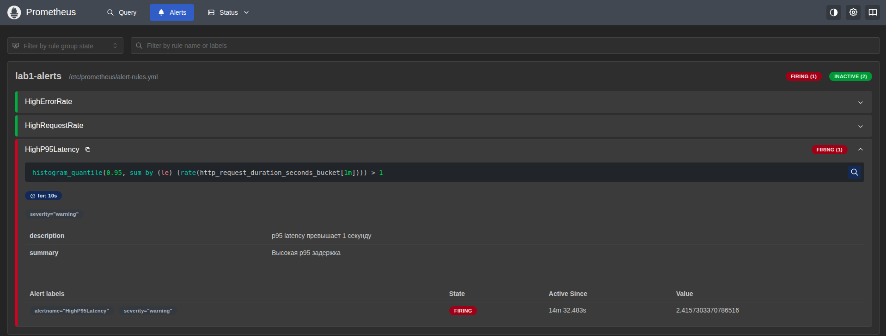

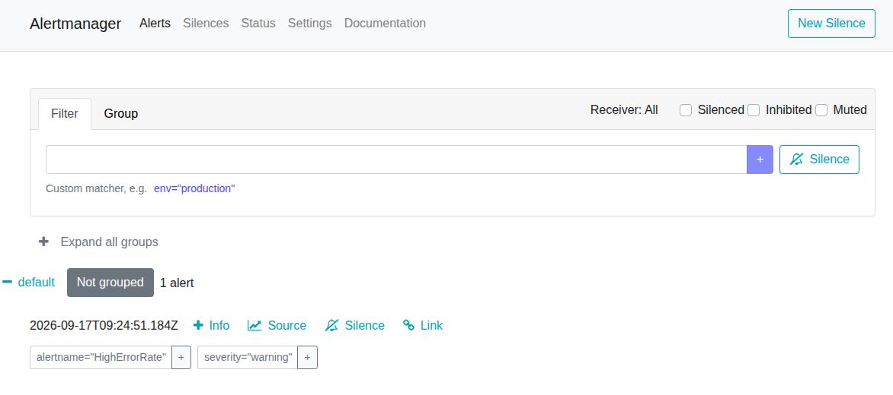

### Отправка уведомлений

Теперь займемся отправкой уведомлений в webhook. Он был выбран, чтобы не заморачиваться с хранением секретов. Сгенерируем в `/webhook` примитивные `webhook.py`, `Dockerfile`. Вывод алертов будем выводить в консоль.

Объявим в compose сборку и запуск webhook сервиса.

```yml
webhook:
    build: ./webhook
    container_name: webhook
```

Добавим получателей в `alertmanager.yml`.

```yml
global:
    resolve_timeout: 5m

route:
    receiver: default
    group_by: ["alertname"]
    group_wait: 10s
    group_interval: 5m
    repeat_interval: 3h

receivers:
    - name: default
      webhook_configs:
          - url: "http://webhook:8080/alerts"
            send_resolved: true
```

Инициируем три разных алерта и смотрим логи. Работает!

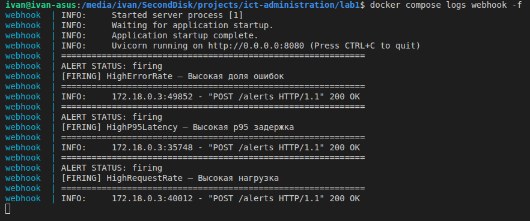

**Чем грозят эти алерты?**

- `HighErrorRate` — грозит тем, что пользователи массово получают ошибки: потеря клиентов, пробитый SLO, а на фоне ошибок ещё и маскируются реальные проблемы (упавшие запросы быстрые, метрики latency p95 врут).

- `HighRequestRate` — грозит тем, что сервис упрётся в потолок по CPU/памяти/соединениям, начнутся очереди и таймауты, всё может закончится падением под нагрузкой (напрмиер, если DDoS или retry-storm).

- `HighP95Latency` — грозит тем, что много запросов будут очень медленными: у клиентов с сильным таймаутом они начнут отваливаться, SLO по latency будет пробит при внешне хороших метриках ошибок.
