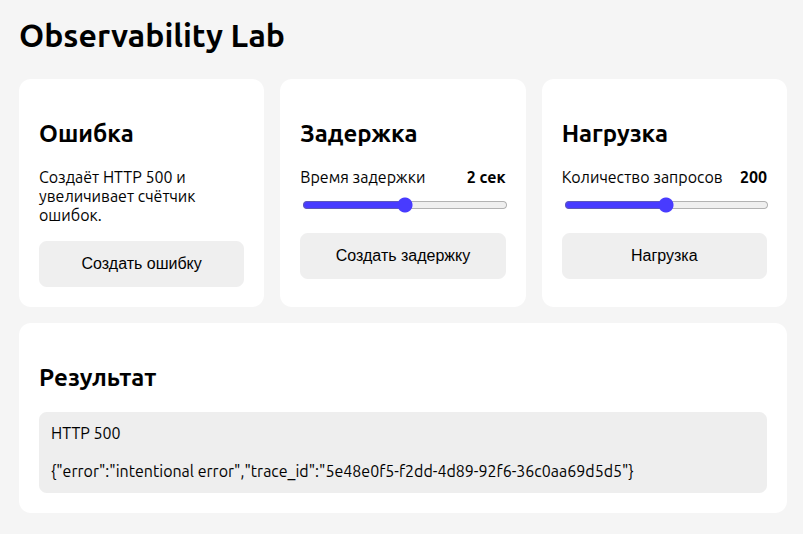
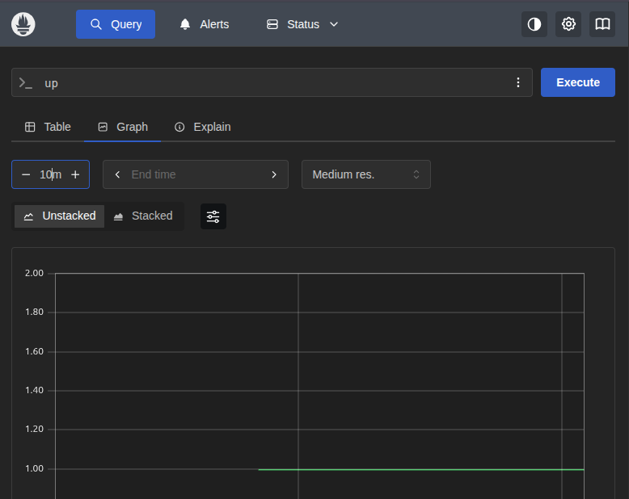
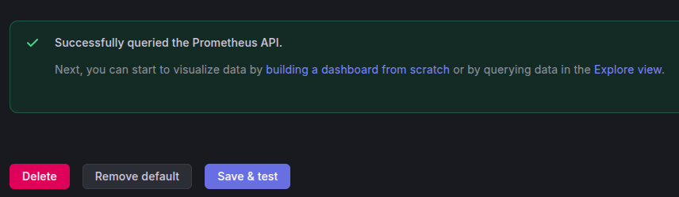
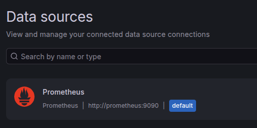
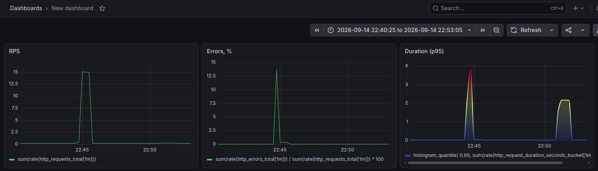
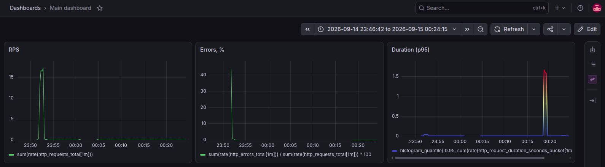

# Лаба 1 — Полный мониторинг маленького сервиса

**Цель**: сделать маленький простой сервис и поднять для него полный мониторинг: метрики, логи и трейсы.

> [!NOTE]
> После беззаботного времени на Windows просим GRUB запускать Ubuntu. Удивляемся, как удобно она была настроена. Синхронизируем vscode, музыку, браузер и конфигурацию Выхода Прямо в Нормальный инет (ВПН). Донастраиваем ещё приколов, приближаясь к полной миграции с окон, и в бой.

## Часть 1 — Маленький сервис с кнопками

Создаем директорию под лабу `/lab1`, внутри под приложение `/app` — вынесем туда vibecode. Просим чатик поработать python fastapi джуном на полставочки. Получаем на выходе: `app.py`, `index.html`, `requirements.txt`, `Dockerfile`.

Команды докера давно забыты, поэтому сразу описываем, что хотим и `docker compose up --build`.

```yml
services:
    app:
        build: ./app
        container_name: app
        ports:
            - "8000:8000"
```

Далее итерациями ругаем чатик за ошибки, вносим мелкие исправления по стилям. Получается минималистичный сайтик на `http://localhost:8000/`.



> [!NOTE]
> Производим фиксацию результата.
> Репозиторий был создан на общем томе. Добавил репозиторий в доверенные, чтобы не ругался.
> Изменения были написаны не в той ветке. Минут 15 пожанглировав в git удалось создать нормально первый коммит и от него перевести работу в ветку `lab1`.

## Часть 2 — Метрики (Prometheus + Grafana)

### Prometheus

Далее описываем настройки Prometheus: собирать метрики каждые 5 секунд, для сбора использовать группу (назовем её `app`) с единственной целью на адресе контейнера `app:8000`.

```yml
global:
    scrape_interval: 5s

scrape_configs:
    - job_name: "app"
      static_configs:
          - targets: ["app:8000"]
```

Описываем сервис с конфигурацией выше (прокинем для проверки порт 9090 наружу).

```yml
prometheus:
    image: prom/prometheus:latest
    container_name: prometheus
    ports:
        - "9090:9090"
    volumes:
        - ./prometheus.yml:/etc/prometheus/prometheus.yml
```

Командуем `docker compose up --build`, открываем `http://localhost:9090/`. По запросу `up` посмотрим график работы приложения за последние 10 минут.



### Grafana

Не опять, а снова описываем сервис Grafana, перезапускаем.

```yml
grafana:
    image: grafana/grafana:latest
    container_name: grafana
    ports: - "3000:3000"
```

Открываем `http://localhost:3000/`, меняем пароль, подключаем источник метрик: `http://prometheus:9090`.



> [!NOTE]
> Я, конечно, подключил, но мне очень неприятно стало, что это произошло в GUI! Поэтому...

Далее создаем конфиг `grafana-datasource.yml`, который буквально нужен для указания источников данных.

```yml
apiVersion: 1

datasources:
    - name: Prometheus
      type: prometheus
      access: proxy
      url: http://prometheus:9090
      isDefault: true
```

Монтируем к сервису в compose.

```yml
volumes:
    - ./grafana-datasource.yml:/etc/grafana/provisioning/datasources/grafana-datasource.yml
```

> [!NOTE]
> Почему-то я решил в части названий и имен написать `ph` вместо `f`. Минут 10 ругался с компьютером, докером и чатиком. А потом заметил опечатку...

Теперь Prometheus как источник автоматически подключается к Grafana.



> [!NOTE]
> Производим фиксацию результата. Идем спать.

### Дашборд по RED

Для начала составим PromQL запросы по RED (попутно разбирая команды с чатиком).

- _Rate (запросы в секунду): `rate(http_requests_total[1m])`_
- _Errors (доля запросов с ошибкой): `rate(http_errors_total[1m]) / rate(http_requests_total[1m]) * 100`_
- _Duration (p95): `histogram_quantile(0.95, rate(http_request_duration_seconds_bucket[1m]))`_

> [!WARNING]
> Пробуем реализовать графики в GUI Grafana. Первый `rate(http_requests_total[1m])` зашел хорошо (и показывал только один график), на следующем же `rate(http_errors_total[1m]) / rate(http_requests_total[1m]) * 100` возникла проблема - данные не отрисовывались. Разобрал по частям, заметил, что `rate(http_requests_total[1m])` вдруг стал отдавать несколько графиков, догадался, что проблема может быть в этом. Вслепую просумировал (наугад обернул в `sum`) числитель и знаменатель второй формулы: заработало. Изменяем формулы: теперь на первом графике общее число запросов, на втором - процент ошибок от общего числа.

- **Rate (запросы в секунду): `sum(rate(http_requests_total[1m]))`**
- **Errors (доля запросов с ошибкой): `sum(rate(http_errors_total[1m])) / sum(rate(http_requests_total[1m])) * 100`**
- **Duration (p95): `histogram_quantile(0.95, sum(rate(http_request_duration_seconds_bucket[1m])) by (le))`**

> [!NOTE]
> Честно отработанный курс матстата решил вдруг исчезнуть из головы и я немного подзавис на интерпретации третьего графика. Покумекав и поболтав с чатиком, дошло, что изображено и что нужно отображать вообще не гистограмму, а time series.

Получаем вот такой красивенький дашборд, настроенный руками.



Далее экспортируем дашборд и описываем конфигурацию для его автоподгрузки.

Создаем конфиг `grafana-dashboards.yml`, который нужен для указания источников дашбордов (_где-то мы это уже видели_).

```yml
apiVersion: 1

providers:
    - name: "Dashboards"
      orgId: 1
      folder: ""
      type: file
      disableDeletion: false
      updateIntervalSeconds: 10
      allowUiUpdates: true
      options:
          path: /var/lib/grafana/dashboards
```

Монтируем к сервису в compose (_и это тоже видели_).

```yml
volumes:
    - ./grafana-dashboard.yml:/etc/grafana/provisioning/dashboards/grafana-dashboard.yml
    - ./dashboards:/var/lib/grafana/dashboards
```

> [!NOTE]
> На этом моменте были потеряны данные сбора метрика, произнесено "какая неудача!" и добавлен volume для prometheus.

Теперь можно сохранять настроенные дашборды в `/dashboards` и они будут автоматически подгружены с пометкой `Managed by: file provisioning`.


